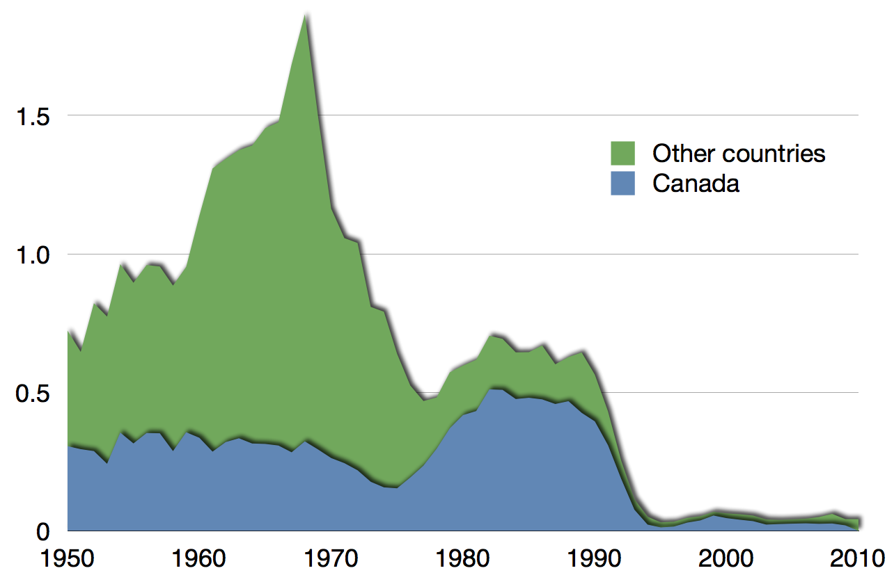

<!-- Limit image width and height -->
<style type='text/css'>
img {
    max-height: 400px;
    max-width: 964px;
}
</style>

<!-- Center image on slide -->
<script src="http://ajax.aspnetcdn.com/ajax/jQuery/jquery-1.7.min.js"></script>
<script type='text/javascript'>
$(function() {
    $("p:has(img)").addClass('centered');
});
</script>

# Plan

> 1. Scatterplots
> 2. Linear regression
> 3. Differential equations for population growth
> 4. PBL


--- .class #id 


# Scatterplots

===============================


```{r, echo=FALSE, fig.align='center', warning=FALSE}
setwd("C://Users//fduzhin//Dropbox//Outreach Fedor//Singapore Poly - regression")
library(ggplot2)
library(HistData)

flats <- read.csv("reflections.csv")
rawFloorArea <- as.character(flats$Floor.Area)
flats$Area <- as.numeric(regmatches(rawFloorArea,regexpr("[0-9]+",rawFloorArea)))
flats <- flats[flats$Area<3000,]
qplot(data=flats,x=Area,y=Rent)
```

Rental price vs floor area at Reflections at Keppel Bay in Apr 2015 - Mar 2016. 


--- .class #id 

# Scatterplots

===============================


```{r, echo=FALSE, fig.align='center'}
qplot(data=mtcars,x=disp,y=mpg)
```

Fuel consumption (miles per gallon) vs engine displacement (cubic inches).

--- .class #id 

# Scatterplots

===============================


```{r, echo=FALSE, fig.align='center', warning=FALSE}
students <- read.csv("ode_students.csv",na.strings = "ABS")
qplot(data=students,x=Project,y=Exam)
```

Ordinary differential equations class at NTU: Final exam score vs PBL score.

--- .class #id 

# Scatterplots

===============================


```{r, echo=FALSE, fig.align='center', warning=FALSE}
qplot(data=diamonds[diamonds$clarity=="IF",],x=carat,y=price, colour=color)
```

Prices of diamonds depending on weight and colour.

--- .class #id 

# Scatterplots

==================================

```{r, echo=FALSE, fig.align='center', warning=FALSE}
library(scatterplot3d)

data(GaltonFamilies)
attach(GaltonFamilies)
colGender <- as.character(GaltonFamilies$gender)
colGender[colGender=="female"] <- "pink"
colGender[colGender=="male"] <- "blue"
scatterplot3d(x=father,y=mother,z=childHeight,
              color=colGender, pch=19, # filled blue circles
              type="h")
detach(GaltonFamilies)
```

Height of children (blue=male, pink=female) depending on father's height and mother's height.

--- .class #id

# Scatterplots

===============================


Number of Nobel laureates per capita vs chocolate consumption

--- &twocol w1:30% w2:70%

# Linear regression

*** =left

Ohm's Law: 
$$
V=IR
$$

> 1. Clearly, the blue line captures the trend better than the green line.
> 2. Try to find $R$ that captures the data best
> 3. For each $R$, define $E(R)$ to be deviation of the line $I=RV$ from observed data
> 4. Optimization problem
$$
E(R)=\quad\leadsto\quad\min
$$
> 5. To find the minimum,
$$
\frac{dE}{dR}=0
$$

*** =right

Data points $(V_k,I_k)$ from measurement:

```{r, echo=FALSE, fig.align='center', warning=FALSE, fig.height=6, fig.width=5}
set.seed(14)
error <- rnorm(20)
ohm <- data.frame(voltage=seq(from=100,to=100+19*5,by=5))
ohm$current <- ohm$voltage*7.5+40*error

ggplot(ohm, aes(x=voltage, y=current))+
        geom_point() + stat_function(fun = function(x) 7.5*x, colour="blue") +
        geom_point() + stat_function(fun = function(x) 6.7*x, colour="green")
```

--- &radio

### Question

What is a correct form of $E(R)$?

1. 1 $E(R)=(RV_k-I_k)^2$
2. 2 $E(R)=\sum_{k=1}^{n}(RV_k-I_k)$
3. _3_ $E(R)=\sum_{k=1}^{n}|RV_k-I_k|$ 

*** .hint
Which quantity depends on all data points and cannot be negative?

*** .explanation
The right answer is 
$$
E(R)=\sum_{k=1}^{n}|RV_k-I_k|
$$
$|RV_k-I_k|$ is deviation of the line $I=RV$ from each data point. It cannot be negative. The sum of all these values measures the total deviation of the line from all data points.

--- .class #id

## Ordinary least squares:

> 1. There are different forms of $E(R)$
> 2. Possible: 
$$
E(R)=\sum_{k=1}^{n}|RV_k-I_k|
$$
> 3. But the most common is
$$
E(R)=\sum_{k=1}^{n}(RV_k-I_k)^2
$$
> 4. Why?

--- .class #id

# Linear regression

> 1. OLS error
$$
E(R)=\sum_{k=1}^{n}(RV_k-I_k)^2\quad\leadsto\quad\min
$$
> 2. First derivative
$$
\frac{dE}{dR}=\sum_{k=1}^{n}2V_k(RV_k-I_k)=0
$$
> 3. Simplifying
$$
R\cdot \sum_{k=1}^{n}V_k^2-\sum_{k=1}^{n}V_kI_k=0\quad\iff\quad
R=\frac{\sum_{k=1}^{n}V_kI_k}{ \sum_{k=1}^{n}V_k^2}
$$
> 4. Linear regression - the line $I=RV$, where $R$ is found as above.

--- .class #id

# Linear regression

```{r, echo=FALSE, fig.align='center', warning=FALSE, fig.height=6, fig.width=10}
set.seed(14)
error <- rnorm(20)
ohm <- data.frame(voltage=seq(from=100,to=100+19*5,by=5))
ohm$current <- ohm$voltage*7.5+40*error

ggplot(ohm, aes(x=voltage, y=current))+
        geom_point() + geom_smooth(method=lm)
```

Discuss the meaning of the shadowed region

--- .class #id


## Linear regression: more general case

Data points $(x_1,y_1),\dots,(x_n,y_n)$. Assumption: $Y=aX+b$.

> 1. OLS error
$$
E(a,b)=\sum_{k=1}^{n}(ax_k+b-y_k)^2\quad\leadsto\quad\min
$$
> 2. First derivatives
$$
\frac{\partial E}{\partial a}=\frac{\partial E}{\partial b}=0
$$
> 3. System of linear equations on $a$ and $b$

--- .class #id

### Rental prices at Reflections

```{r, echo=FALSE, fig.align='center'}
ggplot(data=flats,aes(x=Area,y=Rent)) +
        geom_point() + geom_smooth(method=lm)
```

Is linear regression a true model?

--- .class #id

### Fuel consumption 


```{r, echo=FALSE, fig.align='center'}
ggplot(data=mtcars,aes(x=disp,y=mpg)) +
        geom_point() + geom_smooth(method=lm)
```

Is linear regression a true model?

--- .class #id

### Stopping distance of vintage cars

```{r, echo=FALSE, fig.align='center', warning=FALSE}
ggplot(data=cars,aes(x=speed,y=dist)) +
        geom_point() + geom_smooth(method=lm)
```

What should be the right model?

--- &radio

### Stopping distance of a car

If $v$ is the speed and $s(v)$ is the stopping distance, what's the right model?

1. 1 $s(v)=av$
2. 2 $s(v)=av^2$
3. 3 $s(v)=av+b$ 
4. _4_ $s(v)=av^2+bv$ 


*** .hint
The stopping distance consists of reaction distance and braking distance. 

*** .explanation
The right answer is 
$$
s(v)=av^2+bv
$$
The first term is braking distance, i.e., proportional to the kinetic energy. The second term is reaction distance, i.e., proportional
to the speed of the car.

--- .class #id

### Fedor's ODE class

```{r, echo=FALSE, fig.align='center', warning=FALSE}
ggplot(data=students,aes(x=Project,y=Exam)) +
        geom_point() + geom_smooth(method=lm)
```

Is linear regression a true model?


--- .class #id

### Diamonds of a particular colour

```{r, echo=FALSE, fig.align='center', warning=FALSE}
ggplot(data=diamonds[diamonds$clarity=="IF"&diamonds$color=="G",],
       aes(x=carat,y=price)) + geom_point() + geom_smooth(method = lm)
```

What would be the best model? Square? Exponential function?

--- .class #id

### Diamonds of a particular colour

```{r, echo=FALSE, fig.align='center', warning=FALSE}
ggplot(data=diamonds[diamonds$clarity=="IF"&diamonds$color=="G",],
       aes(x=log(carat),y=log(price))) + geom_point() + geom_smooth(method = lm)
```

What does it mean?

--- .class #id

# Population growth


Exponential growth
$$
\frac{dP}{dt}=rP\quad\leadsto\quad P(t)=P_0e^{rt}
$$

--- &twocol w1:30% w2:70%

## Turkmenistan population

[Desmos graph](https://www.desmos.com/calculator/vniaezuolh)

*** =left

```{r, echo=FALSE, fig.align='center', warning=FALSE}
turk <- read.csv("turkmenistan.csv",na.strings = "ABS")
qplot(data=turk,x=year,y=population)
```

*** =right

```{r, echo=FALSE, fig.align='center', warning=FALSE}
ggplot(data=turk,
       aes(x=year,y=log(population))) + geom_point() + geom_smooth(method = lm)
```


--- .class #id

# Population growth


Logistic growth
$$
\frac{dP}{dt}=r\cdot P\cdot \left(1-\frac{P}{K}\right)
$$


--- .class #id

# Population growth

> 1. Logistic differential equation
$$
\frac{dP}{dt}=r\cdot P\cdot \left(1-\frac{P}{K}\right)
$$
> 2. $r$ - intrinsic growth rate
> 3. $K$ - carrying capacity
> 4. $P_0$ - initial population
> 5. [Desmos graph](https://www.desmos.com/calculator/pc10scmpjb)

--- .class #id

### True story

In 1992, collapse of the Atlantic northwest cod fishery cost 35000 jobs. The industry operated on the ODE
$$
\frac{dP}{dt}=r\cdot P\cdot \left(1-\frac{P}{K}\right)-\alpha P,
$$
where $\alpha$ is the number of fishing boats. The government misinterpreted the data and overestimated the existing fish population.


--- .class #id

### True story



--- .class #id

# PBL

Choose a country. Find its historical population data (it's a part of the challenge). Then you've got to model the population, produce a scatterplot with the model superimposed on data points, and make a prediction. There will be three versions of the challenge and you need to choose one. The harder the challenge, the higher your grade will be.

### Easy version

Assuming the exponential model $P(t)=P_0e^{rt}$, where $P_0$ is directly observed as initial population, fit the model into data and calculate $r$. According to the model, when is the country's population going to reach 6 bln?

--- .class #id

# PBL

Choose a country. Find its historical population data (it's a part of the challenge). Then you've got to model the population, produce a scatterplot with the model superimposed on data points, and make a prediction. There will be three versions of the challenge and you need to choose one. The harder the challenge, the higher your grade will be.


### Medium version

Assume the logistic model
$$
\frac{dP}{dt}=r\cdot P\cdot\left(1-\frac{P}{K}\right).
$$
It depends on 3 parameters, $r$, $K$, and $P_0$. Assign a reasonable value to $K$. Solve the differential equation. Fit $r$ and $P_0$ into data. According to the model, when is the country's population is going to reah 95% of its carrying capacity?

--- .class #id

# PBL

Choose a country. Find its historical population data (it's a part of the challenge). Then you've got to model the population, produce a scatterplot with the model superimposed on data points, and make a prediction. There will be three versions of the challenge and you need to choose one. The harder the challenge, the higher your grade will be.


### Hard version

Assume the logistic model
$$
\frac{dP}{dt}=r\cdot P\cdot\left(1-\frac{P}{K}\right).
$$
It depends on 3 parameters, $r$, $K$, and $P_0$. Solve the differential equation. Fit $r$, $K$, and $P_0$ into data. According to the model, what is the country's carrying capacity?

